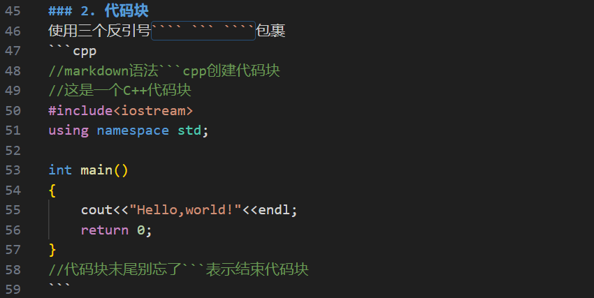

# 如何使用markdown做笔记？

## 一、标题
通过`#`的数量明确标题类型，例如：
```markdown
# 一级标题
## 二级标题
### 三级标题
```
效果：


## 二、强调
使用`*`、`_`和`~`明确不同强调方式
```markdown
*斜体文本*          _斜体文本_
**粗体文本**        __粗体文本__
***粗斜体文本***    ___粗斜体文本___
~~删除线文本~~
```  
效果：  
*斜体文本*         
**粗体文本**        
***粗斜体文本***   
~~删除线文本~~


## 三、列表
### 1. 无序列表
使用`-`、`*`、`+`和空格输出
```markdown
- 列表项一
- 列表项二
    - 子列表项一
    - 子列表项二
- 列表项三
```  
效果：  
- 列表项一
- 列表项二
    - 子列表项一
    - 子列表项二
- 列表项三


### 2. 有序列表
使用`数字.`加空格
```markdwon
1. 第一项
2. 第二项
3. 第三项
```

效果：  
1. 第一项
2. 第二项
3. 第三项

## 四、代码
### 1. 行内代码
使用反引号`` ` ``包裹代码部分（例如在段落中标记变量名、函数名等）
```markdown
Python中的打印函数是`print()`
C++中需要`#include<iostream>`
```

效果：  
Python中的打印函数是`print()`  
C++中需要`#include<iostream>`

### 2. 代码块
使用三个反引号```` ``` ````包裹
```cpp
//markdown语法```cpp创建代码块
//这是一个C++代码块
#include<iostream>
using namespace std;

int main()
{
    cout<<"Hello,world!"<<endl;
    return 0;
}
//代码块末尾别忘了```表示结束代码块
```

## 五、链接与图片
### 1. 链接
```markdown
[显示链接的文本](实际的地址)
```
例如：
这是我的[GitHub主页](https://github.com/Slime267)
### 2. 图片
安装*Paste Image*插件，直接使用*Ctrl+Alt+V*粘贴图片并自动保存至当前目录，效果如下：


## 六、引用
用`>`开头
```markdown
> 可以引用文献或强调文字
```

## 七、表格
使用`|`和`-`绘制
```markdown
| 算法名称     | 时间复杂度 | 空间复杂度 |
| :----------- | :--------: | ---------: |
| 快速排序     |  O(n log n) |    O(log n) |
| 冒泡排序     |   O(n^2)    |    O(1)     |
| 哈希表查找   |   O(1)      |    O(n)     |
```
效果如下：  
| 算法名称     | 时间复杂度 | 空间复杂度 |
| :----------- | :--------: | ---------: |
| 快速排序     |  O(n log n) |    O(log n) |
| 冒泡排序     |   O(n^2)    |    O(1)     |
| 哈希表查找   |   O(1)      |    O(n)     |

**注意**：`:`的作用是控制对齐方式，它在哪边就向哪边对齐

## 八、分隔线
使用三个及以上的`*`、`-`或`_`创建一条分隔线
```markdown
***
---
___
```
效果：

这是一条分隔线（---）
---
这也是一条分隔线（***）
***
这还是一条分隔线（___）
___

